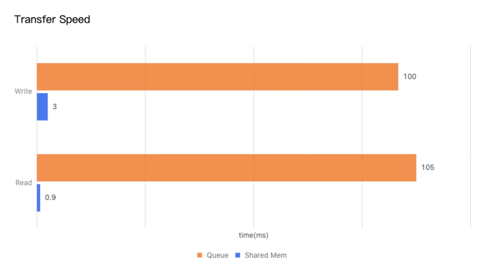
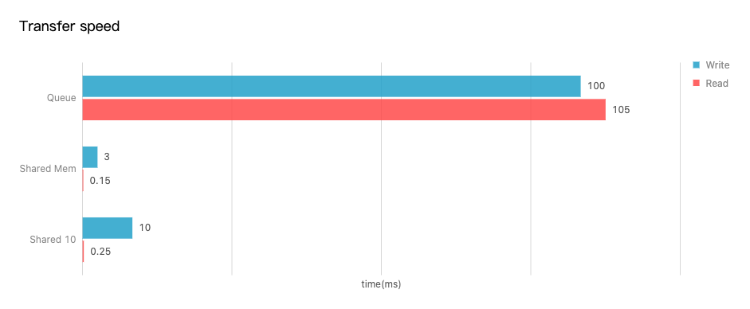
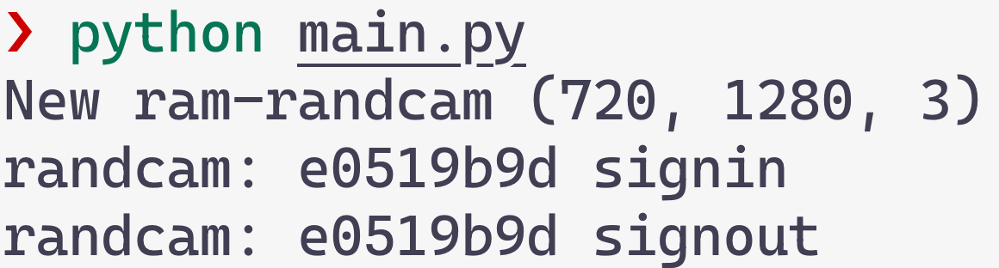
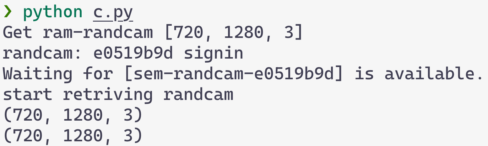

# 🎥 <span style="color:rgb(1, 117, 156);">Strea</span><span style="color:rgb(236, 104, 52);">mem</span>

**High-Performance Video Streaming Memory for Multi-Model Processing**

*Part of the DARPA PTG MILLY Project* 🛡️


## 📋 Overview

Streamem is a high-performance streaming memory system designed for efficient video frame distribution across multiple AI models and packages, developed as part of the DARPA Perceptually-enabled Task Guidance (PTG) MILLY project. It provides minimal memory fingerprinting while enabling seamless video streaming to various processing pipelines with different requirements.


## 🎯 Use Case

Our primary use case involves processing camera streams from HoloLens devices through multiple AI models simultaneously, each with unique environment requirements:

### 🤖 Models in our case

| Model Type | Environment Requirements |
|------------|-------------------------|
| **Behavior Understanding** | Python 3.10 + CUDA 11.2 |
| **Audio Understanding** | Python 3.6 |
| **Audio-Visual Scene Understanding** | Python 3.4+ |
| **OCR** | Python 3.7 + CUDA 10.2 |

## ⚡ Performance Benefits

Streamem achieves exceptional performance compared to traditional queue-based approaches:

- **📥 Queue Write Operations**: Only **3%** of traditional cost
- **📤 Queue Read Operations**: Only **1%** of traditional cost



### Speed Comparison



The chart above compares the performance of three different data transfer methods across write and read operations. The vertical axis shows the three methods—Queue, Shared Memory, and Shared I/O—and the horizontal axis shows time in milliseconds. For each method, a teal bar indicates the average write time and a coral bar the average read time:

- **Queue**: Write operations average ~100ms, read operations average ~105ms
- **Shared Memory**: Write operations average ~3ms, read operations average ~0.15ms  
- **Shared 10 (stress test with 10 consumers)**: Write operations average ~10ms, read operations average ~0.25ms

As demonstrated, Shared Memory provides the fastest performance for both read and write operations, making it the optimal choice for high-throughput data streaming applications.

## 📊 Benchmark Results

### Streaming Performance Comparison

Performance metrics across different hardware configurations (operations per second):

| Operation | Resolution | M1 Max 64GB | i7 8th 2667 16GB | EPYC 3200 1TB | i7 6th 2133 128GB |
|-----------|------------|-------------|------------------|---------------|-------------------|
| **Queue Get** | 1080p | 1,080 | 490 | 80 | 105 |
| **Queue Put** | 1080p | 1,080 | 32 | 25 | 100 |
| **Queue Get** | 720p | 312 | 34 | 24 | 48 |
| **Queue Put** | 720p | 27 | 40 | 13 | 50 |

### 📐 Memory & Bandwidth Calculations

| Resolution | Frame Size | Bandwidth @ 30fps |
|------------|------------|-------------------|
| **1080p** (1920×1080×3×uint8) | 6.5 MB | 200 MB/s |
| **720p** (1280×720×3×uint8) | 2.3 MB | 70 MB/s |

## 🚀 Getting Started

Streamem supports multiple sensor types in `src/sensor.py`. Currently supported sensors include:

- **RandCamera** - Random camera data generator for testing
- **RandMicrophone** - Random microphone data generator for testing
- **RGBCamera** - HoloLens RGB camera stream
- **VLCCamera** - HoloLens VLC cameras (4 positions available)
- **DepthCamera** - HoloLens depth camera with depth and AB data
- **IMU** - HoloLens IMU sensors (accelerometer, gyroscope, magnetometer)
- **Microphone** - HoloLens microphone stream
- **Mevo** - Mevo camera via NDI protocol

To get started:

1. **Start the sensor server** by running `main.py` to bring up the sensor streaming:
   ```bash
   python main.py
   ```

2. **Read from sensors** by running `example/c.py` from anywhere - it's fully distributed and reads memory from the OS without relying on any code in this project:
   ```bash
   python example/c.py
   ```

The client (`example/c.py`) can be run from any environment or project as it operates independently through shared memory, making it completely distributed across different Python environments and system configurations.

### Example Usage

Here's a practical example showing how to use Streamem with two terminals:

**Terminal 1 - Start the Sensor Server:**
```bash
python main.py
```
This will start streaming random camera data to shared memory.



**Terminal 2 - Read from the Sensor:**
```bash
python example/c.py
```
This will connect to the shared memory and continuously read the camera frames, displaying the shape of each frame received.



### ✨ The Beauty of This Architecture

The true elegance of Streamem lies in its **complete decoupling** of data producers and consumers:

🌟 **Environment Independence**: Terminal 2 can be run from:
- Any directory on your system
- Any Python environment (different versions, virtual envs, conda envs)
- Any project or codebase
- Even different programming languages (not just Python)

🚀 **Zero Dependencies**: The client doesn't need:
- Access to Streamem source code
- Installation of the Streamem package
- Matching Python versions
- Same virtual environment

💡 **Direct OS Integration**: Data flows through the operating system's shared memory, enabling:
- Lightning-fast access (no network overhead)
- True distributed computing
- Multiple consumers reading simultaneously
- Cross-process, cross-environment data sharing

This means you can have your AI models running in completely isolated environments while all accessing the same high-performance video stream.


---

*Streamem - Efficient video streaming for the AR AI Assistant* 🎬✨


